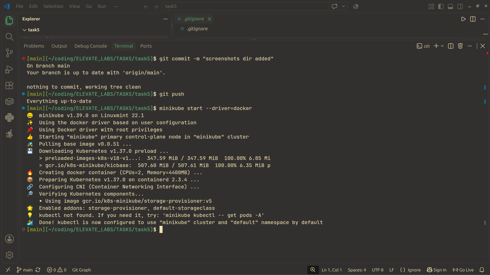
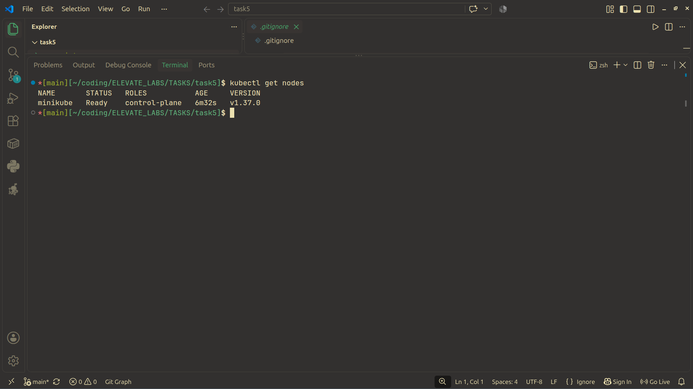
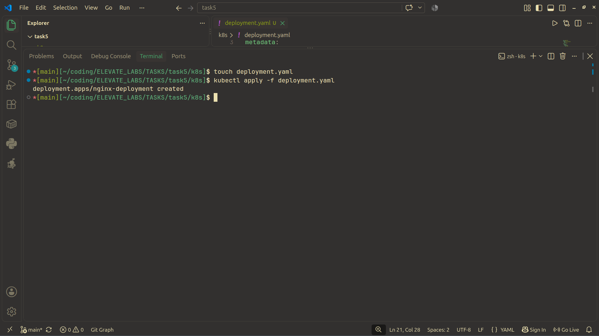
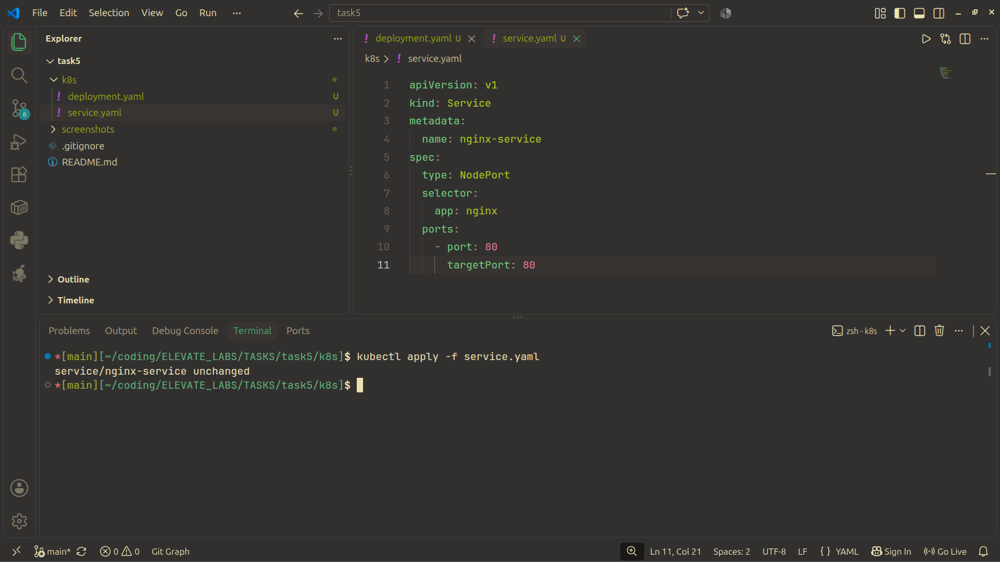
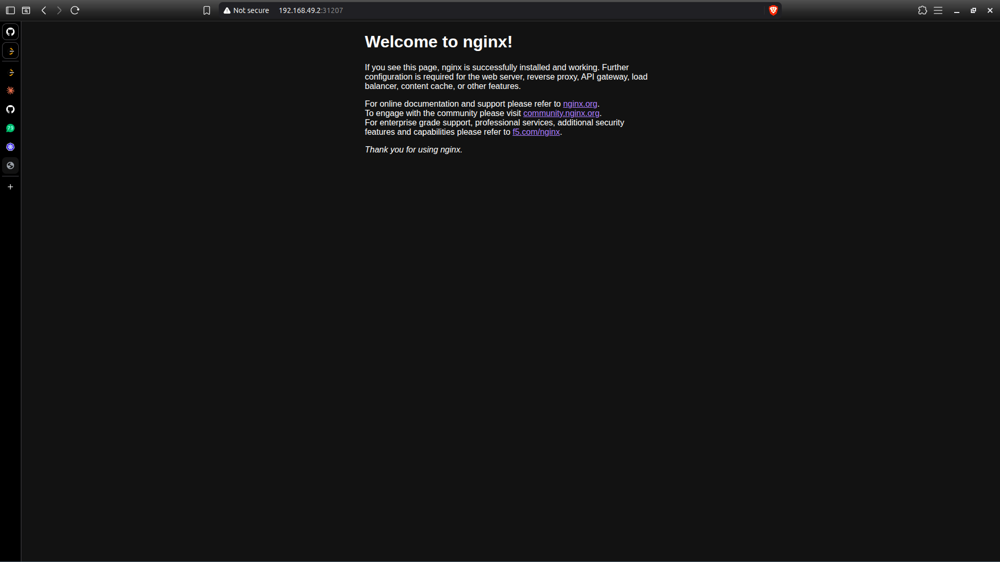
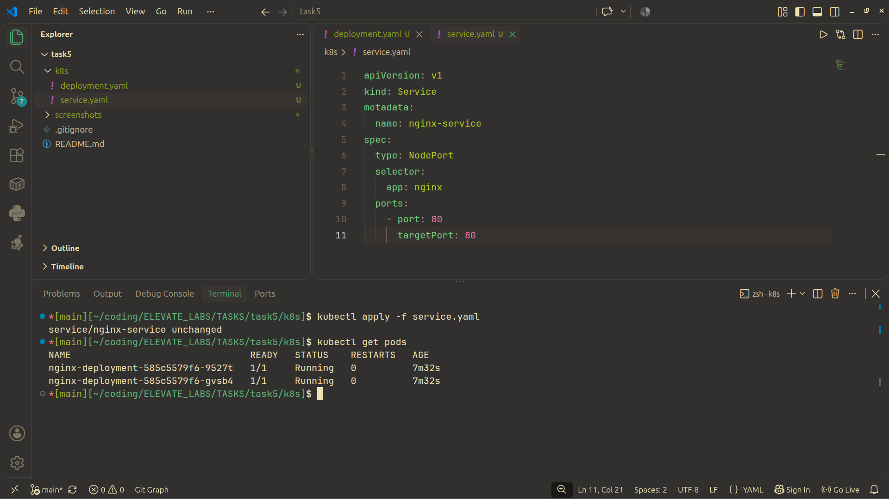
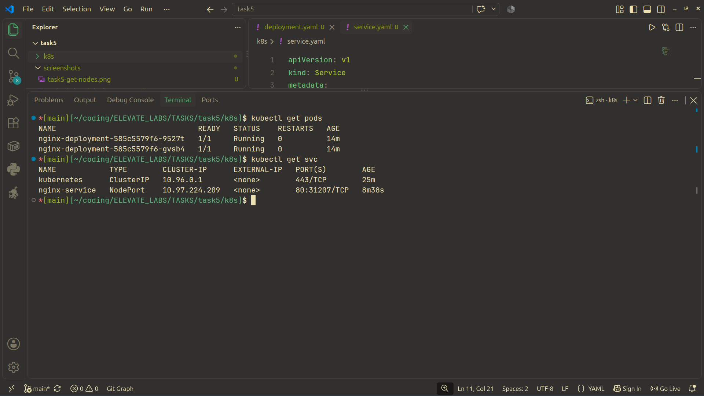
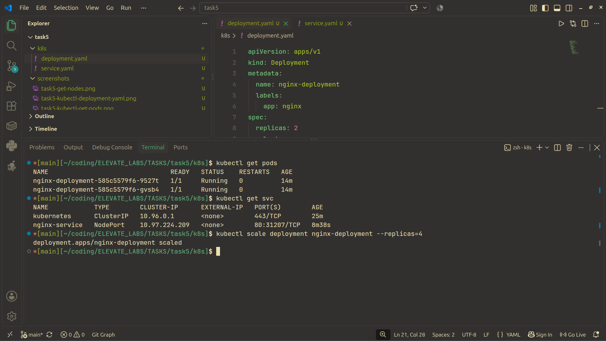
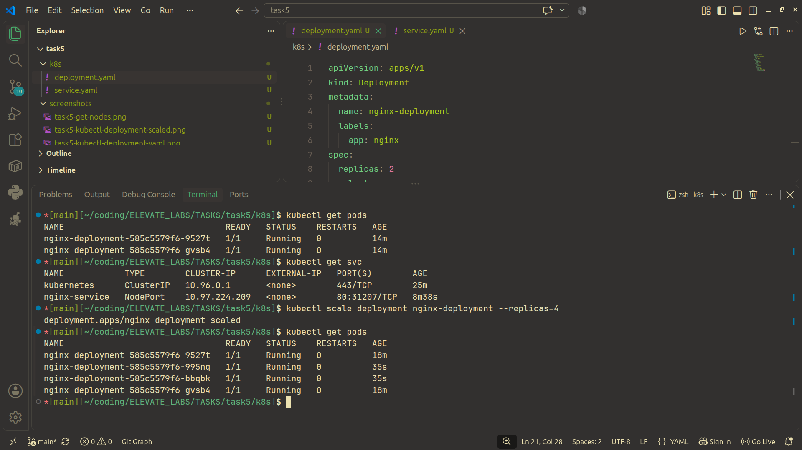
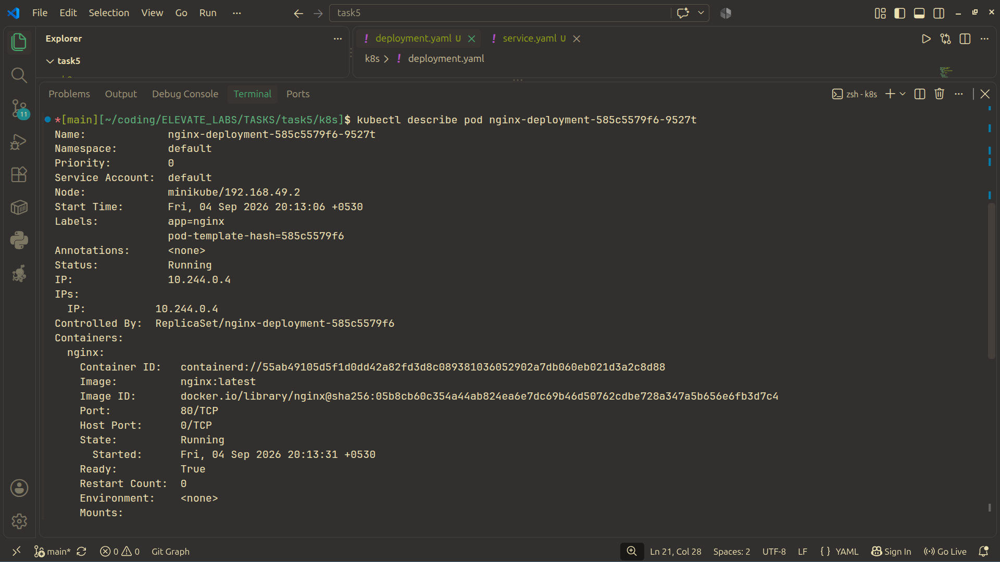

## Task5
This is a kubernetes bases task.
We have to create an app and its service.
Then we have to create a deployment.yaml and service.yaml file.
In my case, I have created a nginx app.
Then I have to run kubectl apply -f deployment.yaml and do the same for service.yaml.
Then it will be applied and the service and the 2 nginx apps will run.
After that we scale the 2 nginx apps to 4.

## Screenshots
## 1. kubectl minikube running

## 2. kubectl get nodes

## 3. kubectl deployment.yaml

## 4. kubectl services.yaml

## 5. pods and services before scaling to 4

## 6. After scaling to 4 

## 7. kubectl describe pod
